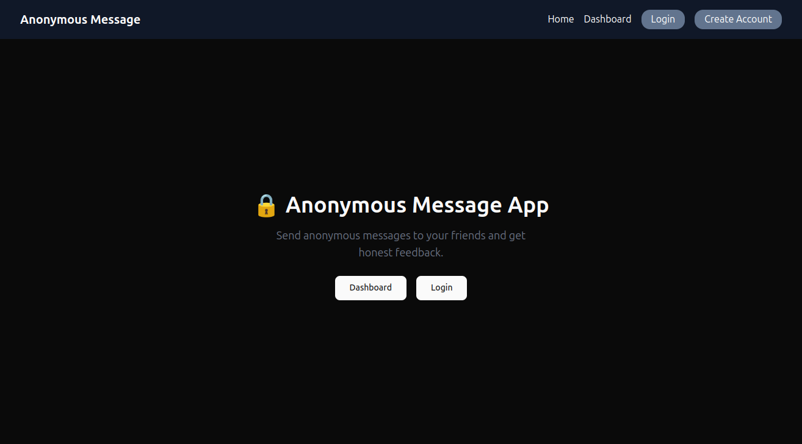
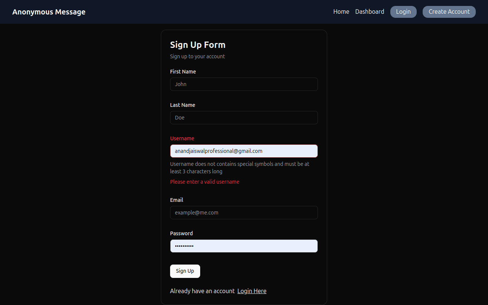
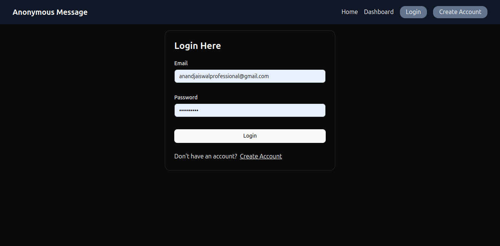
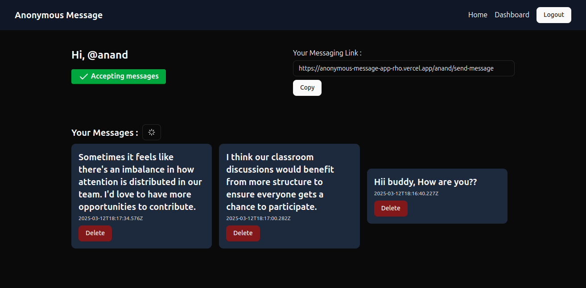
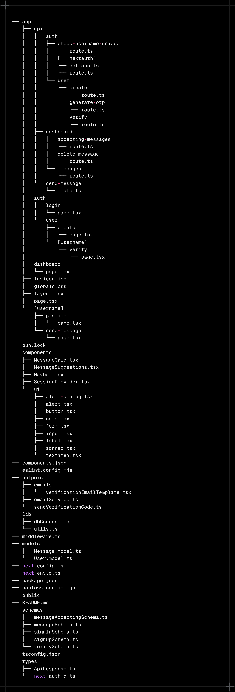

# Anonymous Message App

This is a full-stack anonymous messaging application that allows users to send and receive anonymous messages.

## Features

- **User Authentication:** Users can sign up, log in, and log out.
- **Anonymous Messaging:** Logged-in users can send anonymous messages to other users.
- **Dashboard:** Users have a dashboard where they can view received messages.
- **Unique Usernames:** Each user has a unique username.
- **Message Acceptance Control:** Users can control whether they want to accept anonymous messages or not.
- **Verification:** Users are verified by email.

## Tech Stack

- **Framework:** Next.js
- **Language:** TypeScript
- **Database:** MongoDB
- **Authentication:** NextAuth.js
- **Styling:** Tailwind CSS
- **Schema Validation:** Zod
- **ORM:** Mongoose

## Getting Started

### Prerequisites

- Node.js
- MongoDB

### Installation

1.  Clone the repository:

    ```bash
    git clone https://github.com/anandjaiswal-IN/anonymous-message-app.git
    ```

2.  Install dependencies:

    ```bash
    npm install
    ```

3.  Set up environment variables:

    Create a `.env` file in the root directory and add the following variables:

    ```env
    MONGODB_URI=your_mongodb_uri
    NEXTAUTH_SECRET=your_nextauth_secret
    ...
    ```

4.  Run the development server:

    ```bash
    npm run dev
    ```

Open [http://localhost:3000](http://localhost:3000) with your browser to see the result.

## Screenshots






## Project Structure

